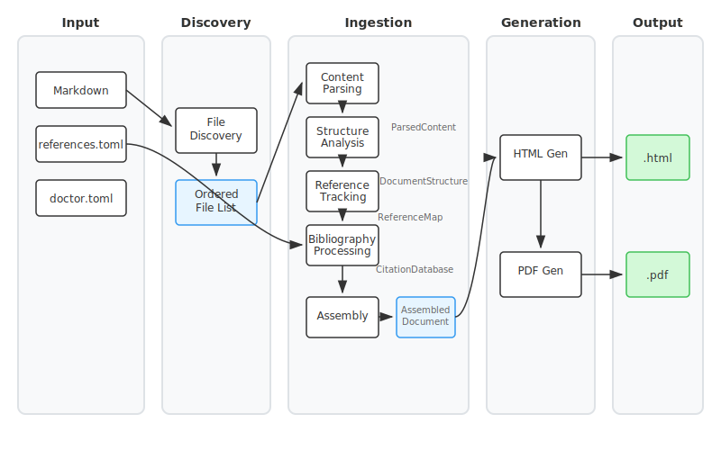
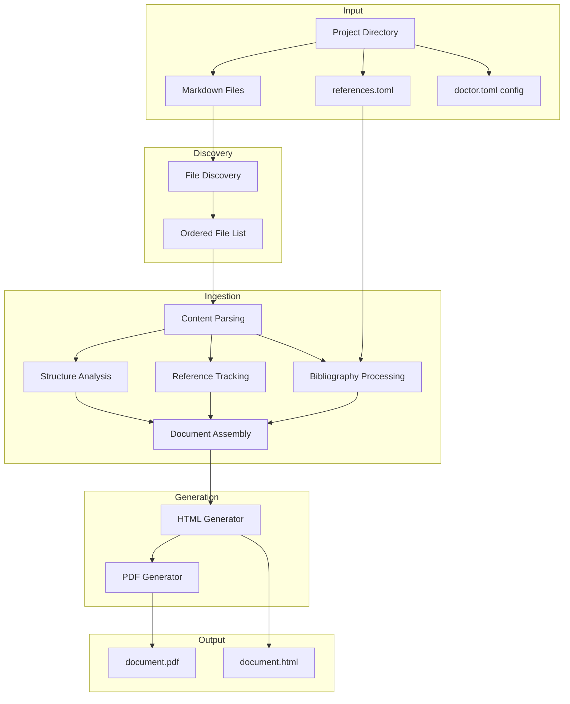

# Doctor Architecture

Doctor is a document compiler that transforms a directory of markdown files into professional academic documents (PDF, HTML). It handles LaTeX math, citations, cross-references, and multi-file projects.

## Pipeline Overview

Doctor processes documents through a linear pipeline with distinct phases:



<details>
<summary>Mermaid source</summary>



</details>

## Phase Details

### 1. Discovery

**Input:** Project directory path
**Output:** Ordered list of markdown files

Discovery walks the project directory, finding all markdown files while respecting `.docignore` patterns. Files are sorted using academic document conventions:

- Front matter first (files in directories starting with lowercase roman numerals: `i.`, `ii.`)
- Main chapters next (directories starting with `1.`, `2.` or `I.`, `II.`)
- Appendices last (directories starting with `A.`, `B.` or named "Appendix")

### 2. Ingestion

Ingestion transforms raw markdown into a structured data model through several processing stages:

| Stage | Input | Output | Purpose |
|-------|-------|--------|---------|
| **Content Parsing** | Markdown files | `ParsedContent` | Extract frontmatter, sections, math, citations, links, footnotes |
| **Structure Analysis** | ParsedContent | `DocumentStructure` | Build hierarchy, generate TOC, number sections |
| **Reference Tracking** | ParsedContent | `ReferenceMap` | Resolve wikilinks, validate figure paths |
| **Bibliography Processing** | ParsedContent + references.toml | `CitationDatabase` | Match citations to bibliography entries |
| **Document Assembly** | All above | `AssembledDocument` | Combine everything, validate integrity |

The final `AssembledDocument` contains everything needed for rendering: complete document structure, resolved references, formatted bibliography, and validation results.

### 3. Generation

Generation transforms the assembled document into output formats:

**HTML Generator**
- Uses Jinja2 templates for document layout
- Converts markdown content to semantic HTML
- Embeds CSS styling for academic formatting
- Preserves LaTeX math for client-side rendering (KaTeX)

**PDF Generator**
- Builds on HTML output
- Uses Playwright (headless browser) for high-fidelity PDF rendering
- Produces print-ready academic documents

## How Generation Uses the Data Model

The `AssembledDocument` is explicitly passed to the HTML generator, which extracts its fields into a Jinja2 template context:

```python
# HTMLGenerator._build_template_context()
context = {
    "title": document.title,
    "author": document.author,
    "table_of_contents": document.table_of_contents,
    "document_structure": document.document_structure,
    "bibliography": document.bibliography,
    "citation_database": document.citation_database,
    # ... etc
}
template.render(**context)
```

The Jinja2 template then iterates over the data model objects directly:

```jinja

    {{ render_sections(file_struct.parsed_content.sections) }}



    [{{ loop.index }}] {{ entry.author }} ({{ entry.year }}). {{ entry.title }}

```

**Important:** Section content is stored as raw markdown strings within the `Section` objects. During template rendering, a custom `markdown_to_html` Jinja2 filter converts this to HTML. This filter handles:

- Bold, italic, code formatting
- Lists and tables
- Citation links (`[@key]` → numbered reference links)
- Wikilinks (`[[page]]` → internal links)
- Footnote references

LaTeX math (`$...$` and `$$...$$`) is left untouched in the HTML output. KaTeX JavaScript renders it client-side in the browser.

One gap in KaTeX is papered over at render time: KaTeX has no double-struck digits, so `\mathbb{1}` would silently render as a plain roman 1. The generator templates inject a `preProcess` hook and a small embedded webfont (see `generators/mathbb_digits.py`) that reroute `\mathbb` digits to double-struck glyphs; `\mathbb` letters keep the stock KaTeX path.

For PDF generation, the HTML output is loaded into a headless browser (Playwright) which renders the complete page—including KaTeX math—then exports to PDF.

## Data Model

The data model captures document structure at multiple levels:

```
AssembledDocument
├── DocumentStructure
│   └── FileStructure[]
│       ├── ParsedContent
│       │   ├── FrontMatter (title, author, date, abstract)
│       │   ├── Section[] (hierarchical, with content)
│       │   ├── MathBlock[] (LaTeX expressions)
│       │   ├── Citation[] (bibliography references)
│       │   └── FootnoteRef/Def[] (footnotes)
│       └── DocumentOutline
│           └── TocEntry[] (numbered table of contents)
├── ReferenceMap
│   ├── ResolvedReference[] (wikilinks, figures)
│   └── AssetReference[] (images, files)
├── CitationDatabase
│   ├── BibliographyEntry[] (from references.toml)
│   └── ProcessedCitation[] (matched to entries)
└── Validation Results
    ├── broken_references
    ├── missing_citations
    └── warnings
```

## Key Dependencies

| Component | Tool | Purpose |
|-----------|------|---------|
| Configuration | Pydantic | Data validation, settings models |
| Templates | Jinja2 | HTML document generation |
| Math Rendering | KaTeX | LaTeX to HTML (client-side) |
| PDF Generation | Playwright | Browser-based HTML-to-PDF |
| Bibliography | TOML | Citation database format |

## Configuration

Doctor uses TOML configuration files (`doctor.toml`) for:

- Document metadata (title, authors, date)
- Page layout (paper size, margins)
- Citation style (numeric, author-year)
- Output options (formats, paths)

Configuration can be specified at project level or via command line.

## Markdown Extensions

Doctor recognizes the following markdown extensions:

| Syntax | Purpose |
|--------|---------|
| `$$...$$` | Display math (LaTeX) |
| `$...$` | Inline math (LaTeX) |
| `[@key]` | Citation reference |
| `[[page]]` | Internal wikilink |
| `![[image.png]]` | Figure embed |
| `[^id]` / `[^id]:` | Footnote ref/definition |
